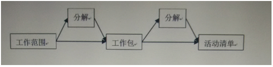

# 如何更好地创建W85计划？

在我们团队A软件的开发过程中，必不可少的一项活动是制定WBS计划，但是最终制定的WBS计划在执行过程中经常偏差较大，回顾之前的软件开发活动，我们的WBS计划偏差较大的原因有：
* 项目周期太长，中间有临时任务插入进来，但是交付时间不变
* 对子任务的拆解程度不够，颗粒度较大，进而预估的任务时间不准
* WBS计划中有遗漏的部分
* WBS计划拆解的任务有关联部分的工作预估时间严重不足
* 当然还有倒排

为了后面制定计划的时候更可靠，更科学，学习了PMBOK中的创建WBS计划过程的一些知识，与各位分享。

文章将依次回答下面的问题： 
* 什么是WBS？
* 为什么要制定WBS计划？
* 如何更好地制定WBS计划？

## 什么是WBS？ 
WBS的英文是work breakdown structure，不妨再仔细看看英文的意思： 
* Work：工作内容，范围，注意，界定工作的边界很重要
* Breakdown: 肢解，逐步细化的过程 
* Structure: 结构，时间顺序，空间顺序，重要程度顺序等 

**创建WBS计划的过程就是工作范围内的内容的逐步层级分解过程， 分解的结果是一系列的最小可交付成果的集合，这个最小可交付成果也叫工作包。**

继续向下看，其实工作包是一系列活动的结果，因此，在制定实际的进度执行计划时，还要继续分解为活动清单，下图其实就是我们之前经历过的活动简图:

**分解过程是制定WBS计划过程中最核心的活动，要耗费大量的脑力，换句话说就是把一个大的东西按照一定的逻辑结构分解成最小可执行单元的过程。逐层分解的过程中，最核心的原则是：相互独立，完全穷尽。也就是分解的任务之间，不遗漏任何一项必要工作，不重复已经存在的工作。** 在分解活动中，要不断思考下一层次间的组合关系，如是结构顺序还是空间顺序？如是按照时间来组织还是按照重要性来组织活动？

## 为什么要制定WBS计划？
**这听起来像是废话，但是我们知道，听起来是废话的东西其实不是废话不对，而是没有做到！** 在分解项目的过程中，不管是项目经理，还是项目参与人员对项目的整体理解程度会更深，对项目的风险识别，进度计划，实现方案都有较清楚的认识，这会大大降低的不确定性，所以，让参与项目人员制定WBS计划是有效果的而且是项目管理过程中重要的活动这一。

如果说我们的项目目标是画一个美丽的图画，那么，制定WBS计划的过程是思考如何作画的过程，也就是达成目标的路径在完成这项活动后应当了然于心，如可能遇到什么困难及那个地方要花大力气突破，达成目标的时间，成本等，在这个过程中，我们必然对整个过程有了比较深入地认识，在执行过程中也会有目标感，方向感。
在我看来，制定WBS计划至少有下列作用：
* 有助于识别项目风险并形成风险预案
* 对项目时间的估算使对项目周期的理解更准确
* 对项目投入资源，包括人力，物力，材力的估算，使对项目的投入认识更深入
* 是一把计划的标尺，体检项目的基础，是项目变更的基础
* 可以帮助测量员工绩效

## 那么重要的问题来了，如何更好的制定WBS计划？
* 清晰定义的项目范围，这是前提，需要特别重视，方向一定不能偏
  * 分析项目目标，识别项目的可交付成果
  * 清晰明确的定义项目的范围，不可大意
* 确定分解的结构
  * 项目时间长度合理么？如果项目时间长度很大，比如说3年，你能计划好3年内所有的东西么？答案不言自明，对这种项目，先按照时间段划分成比较小的时间段(6个月或者1年）才是符合逻辑的选择。
  * 项目的结构应当是怎样的？对于我们的软件开发项目，不管是迭代开发模式还是瀑布开发模式，下列活动必不可少，需求分析，软件设计，软件编码，软件测试，发布，这些活动间是线性的，上一阶段没有完成下一阶段根本无从下手，就算下手也是接近白搞，那么分解的整体结构就应当按照这个线性阶段来创建WBS计划。
* 再对向下的每个层级进行类似的思考，逐层细化，直到最低层是可以较准确地评估出一项活动的执行时间为止。
* 从下向上分析，每一层依次问**这是完成上面任务的必要组成部分么？去除一切不产生价值的环节，去除一切不产生价值的活动。** 

下面是在制定WBS计划过程中需要仔细考虑的问题： 
* 要不要全员参与？如果可以的话，答案是肯定的，让成员参亲自参与制定过程，在项目前期使项目成员尽早进入状态，而在这个过程中，对项目了解程度加深，更有成就感，有了充分讨论的基础，对项目后期的执行能产生不小的助益。
* 有没有成熟的模板可以应用？成熟的模板是之前有效的经验总结，提供结构化思考的过程，所以，如果有好的模板，采用吧，如果别人的模板不好用，改讲或者自己设计一个V1.0，在后续的软件开发过程中，不断迭代此模板即可。
* 请有经验的同事把关，最好是专家来把关，提出好的建议，看到风险与陷阱。
* 要细到什么程度？我认为这个问题没有答案。细化到可以较好地监控项目开展过程即可，需要在实践中反复实践以拿捏那个度。 

在制定WBS计划的过程中，上面的感觉还是太复杂，为了将来更好地落地，我认为在制定WBS计划的时候仔细思考下列问题：
* WBS计划是不是必须的？
  * 以过去的经验来看，个人认为项目周期在4个星期开外，需要3人以上参与的，完整的或者说较细致的WBS计划应该是必须的。
  * 如果项目周期本来就小，时间还比较短，过去的经验稍微思考一下就足以覆盖掉项目，那么不用制定完整的WBS计划，但在头脑中对后面的执行过程已经有了一个比较清晰的思考
  * 不要WBS计划是可以的，但是项目的目标必须要清楚，WBS计划是详细的执行过程，指明方向与路径，所以，思考项目的目标及明确项目的完成路径是必需的过程，这个过程不能省略，但是形势可以根据情况进行灵活调整。大一点的项目，就仔细制定W BS计划，小一点儿就简化文件的输出过程，弄清楚路径即可。
* WBS计划的整体结构应该如何划分？
  * 比如是设计一个飞机的外形，那整体的WBS计划结构很有可能是按照机器的组成部分进行划分，如机翼模块，发动机模块，机身模块，滑轮模块等 
  * 对我们软件开发项目而言，一般的整体结构是线性的，如一个模块开发过程中的需求澄清，功能设计，开发及调试，模块功能测试等阶段，对由多个模块组成的项目，那么先进行模块的划分与讨论，再在模块内进行上述的阶段划分。
* WBS计划的制定由核心开发人员独立搞还是全体成员一起参与搞定？
  * 小的项目，或者其它成员不具备评估活动的能力，那么由项目核心成员搞定就可以了，因为核心开发人员的认知可以覆盖整个项目，制定WBS计划则相对可靠，减少风险。
  * 大的项目，有经验的团队，由成员自己制定自己模块WBS计划是合理的，主要原因是软件其实是存在于开发人员脑中的，开发人员对自己领域内的东西细节了解的非常多，制定计划与活动的分解更可靠。全体参与感是必须的，不能只让同事做事情，还要让他们思考，脑力发挥，充分参与。
* WBS计划需不需要评审？如何评审？
  * 正常情况下，制定WBS计划的小伙伴是需要自己检查多次的，虽然不可能总是正确，但可以想的更清楚。
  * 时间，资源，人力可控制的情况下，请尽可能让更多的成员参与WBS计划的评审过程，至少有两个好处，一是团队可以相互了解团队成员的工作内容是什么，二是多角度地看待问题，会看到一个同事看不到的盲点。从而让评审的角度更多维，更动态
* 追问WBS计划是否是可控的？有哪些风险点？
  * 如果上面的过程都想清楚了，以过去的经验来看，只要执行到位，一般来讲，这个WBS计划还是相对可靠的。 
  * 上面过程的评估其实是路径细化的过程，在路径细化的过程中，能看到一些过去看不到的风险，也能看到过去曾经走过的一些坑，进而识别出项目的风险点，那就可以提前准备风险应对措施，早做准备，不至于手忙脚乱
  
最后，由于不确实性，有时候就算那个计划再完美，在执行时还是会落后于项目计划的，这在不少项目经历中证明了这一点，如果那一天偏出计划了，尽力赶上，但是如果项目最终还是延期了，嗯，你懂的，**放出有问题的东西比延期放出没有问题的东西后果更严重!**
  
  
  
  
